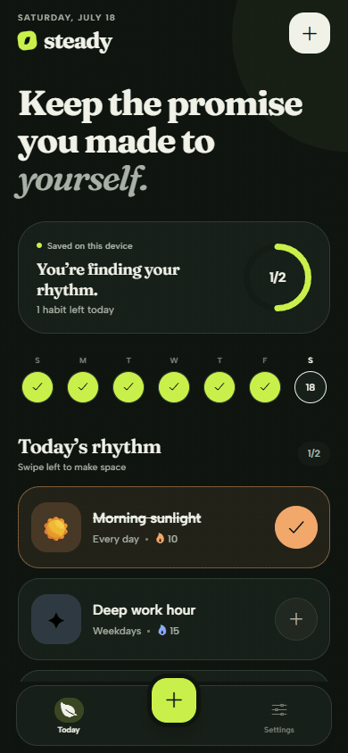
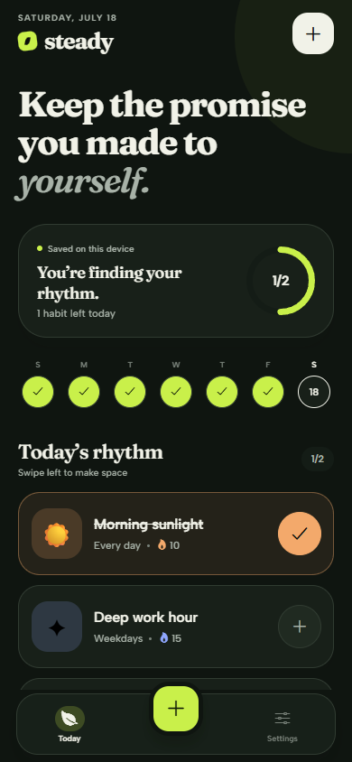
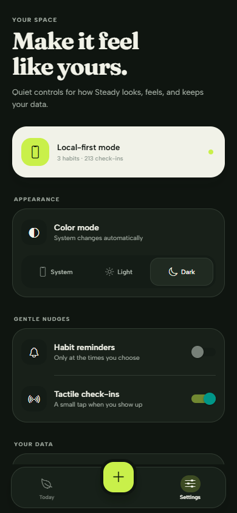

<p align="center">
  
</p>

<h1 align="center">Steady</h1>

<p align="center">A calm, offline-first habit tracker for returning to what matters.</p>

<p align="center">
  
  
  
  
  
</p>

## Why I built this

Most habit trackers turn a missed day into a verdict, when the useful part is simply returning. I built Steady to explore how thoughtful motion, tactile feedback, and an offline-first architecture can make that return feel inviting.

Built as a product-quality UI/UX study for [buildfast.us](https://buildfast.us).

## The experience

- **A focused today view** with progress, a seven-day pulse, pull-to-refresh, and swipe-to-delete
- **Optimistic check-ins** that update immediately, then sync quietly in the background
- **Satisfying feedback** through spring motion, haptics, animated checkmarks, and a brief confetti burst
- **A complete habit editor** with emoji, color, daily or weekday schedules, and optional local reminders
- **Progress without pressure** using current and best streaks, a 12-week contribution heatmap, and weekly completion bars
- **Designed empty and loading states** rather than blank screens or blocking spinners
- **Real system theming** plus explicit light and dark choices
- **Portable data** with one-tap CSV export

The app ships with a small demo garden, so the experience is visible immediately. Clear it from Settings to see the custom empty state.

<p align="center">
  
  
</p>

## Technical notes

Steady writes every change to AsyncStorage first. Each mutation is also added to a small outbox; when Supabase is configured and connectivity returns, the outbox is flushed and the canonical remote snapshot is pulled back down.

No backend is required for the app to work. With Supabase credentials present, Steady creates an anonymous session, applies row-level security, and adds cloud continuity without introducing an auth screen into the demo.

The visual system uses Fraunces and Albert Sans, a warm near-black/linen palette, custom SVG data visualizations, React Native Gesture Handler, and Reanimated entrance and micro-interactions.

## Run it

```bash
npm install
npm start
```

Then press `a` for Android, `i` for iOS, or `w` for web. iOS native builds require macOS; Expo Go works for the core experience, while a development build is recommended for notification testing.

Quality checks:

```bash
npm run typecheck
npm run build:web
```

## Optional Supabase sync

1. Create a Supabase project.
2. Run [`supabase/schema.sql`](./supabase/schema.sql) in the SQL editor.
3. Enable **Anonymous Sign-Ins** in Authentication → Providers.
4. Copy `.env.example` to `.env` and add the project URL and anon key.
5. Restart Expo.

```env
EXPO_PUBLIC_SUPABASE_URL=https://your-project.supabase.co
EXPO_PUBLIC_SUPABASE_ANON_KEY=your-anon-key
```

The deliberately small schema is the trust signal:

```sql
create table public.habits (
  id uuid primary key default gen_random_uuid(),
  user_id uuid not null references auth.users(id) on delete cascade,
  name text not null,
  icon text not null,
  color text not null,
  frequency jsonb not null default '{"type":"daily"}'::jsonb,
  reminder_time time,
  created_at timestamptz not null default now(),
  updated_at timestamptz not null default now()
);

create table public.check_ins (
  id uuid primary key default gen_random_uuid(),
  habit_id uuid not null references public.habits(id) on delete cascade,
  date date not null,
  completed_at timestamptz not null default now(),
  unique (habit_id, date)
);
```

The checked-in SQL file also adds indexes, an `updated_at` trigger, and owner-only RLS policies for both tables.

## Project map

```text
src/
├── components/       Reusable cards, skeletons, charts, and empty states
├── context/          Optimistic app state and mutation outbox
├── data/             Dynamic demo data
├── navigation/       Native stack and custom bottom navigation
├── screens/          Today, habit form, detail, and settings
├── services/         Storage, reminders, and optional Supabase sync
└── utils/            Schedule, streak, and completion calculations

supabase/schema.sql    Database, indexes, trigger, and RLS
```

## Product decisions

- A missed current day does not break a streak until that day has passed.
- Weekday habits skip unscheduled days when calculating streaks.
- Failed cloud writes never roll back a local check-in; they remain queued.
- Theme preference defaults to the device and can be overridden explicitly.
- Reminder scheduling is rebuilt from the current habit set, avoiding stale notifications after edits.

---

Made with care by [buildfast.us](https://buildfast.us).
